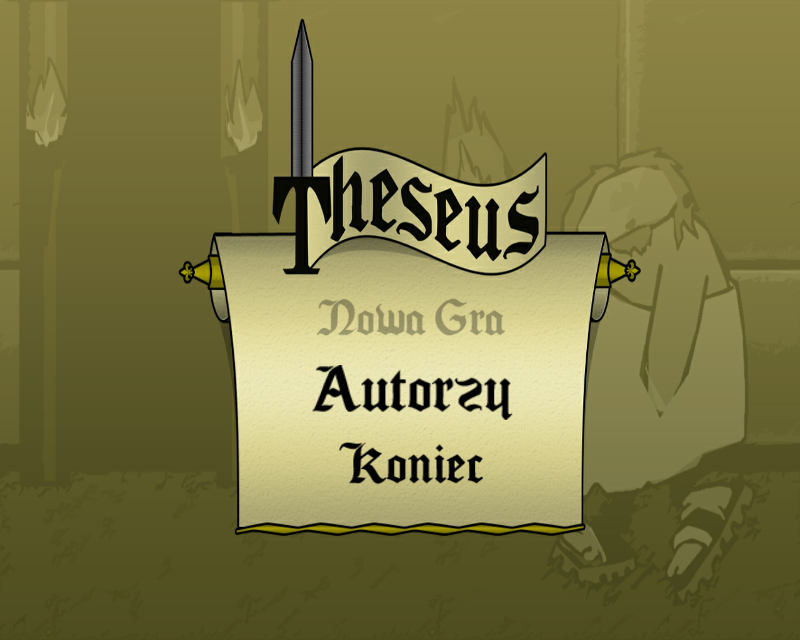
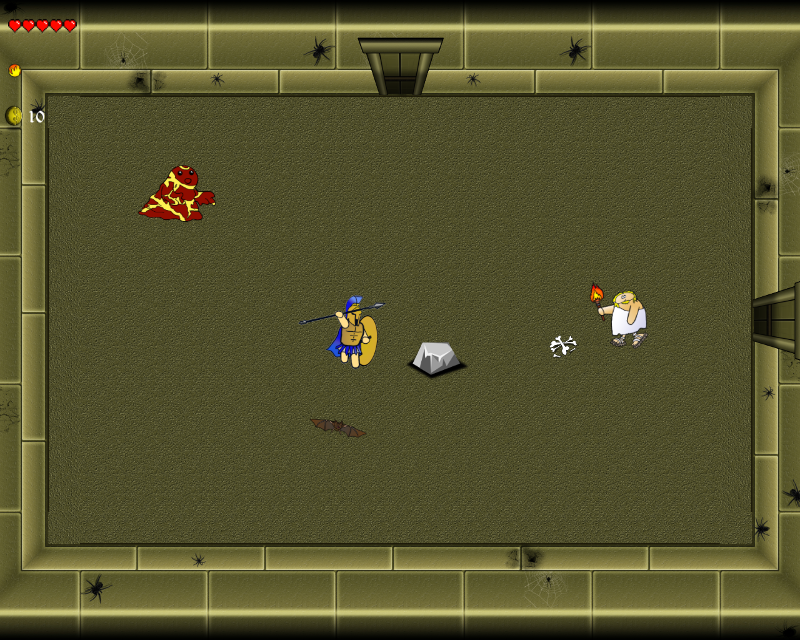

# Theseus
**Current version: 1.0.3**

The Binding of Isaac clone game presenting greek legend mithology about Theseus, hero that defeat Minotaur."The Binding of Isaac" clone game, presenting greek legend mythology about Theseus, who was a hero that defeat Minotaur.

### More about
Theseus is a 2d action game in which player must defeat final boss of the labyrinth - Minotaur, but it won't be that easy because there are many creatures hunting for fresh human blood.
Don't be afraid hero, grab your sword and jump into the battle with thousands of monsters. Save the people of Greece. *Game is in polish language*.

### Features
- Animated Theseus that player can control
- Animated and scripted monsters
- All characters can be stunned, slowed or poisoned
- Levels and monsters are generated randomly
- Scripted boss fight
- Shop and Treasure rooms
- Potions, powerup`s, stat boosts that player can find or buy
- Ingame music and narration

### Dependencies
Unity 3D engine version 5.3.0 or later, available for download at [Official Site](https://unity3d.com/).

### How to use this application

##### Compile
1. Run Unity3D Editor
2. Open Theseus project
3. Click on `File->Build` settings option from top menu
4. Build project (include all scenes) for PC platform

##### Run
1. Open Theseus compiled binary file and enjoy the game

